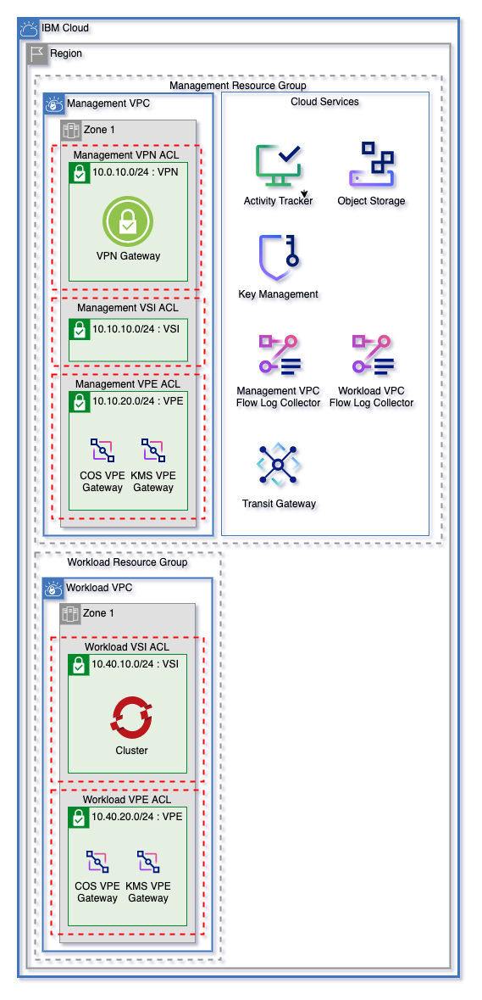
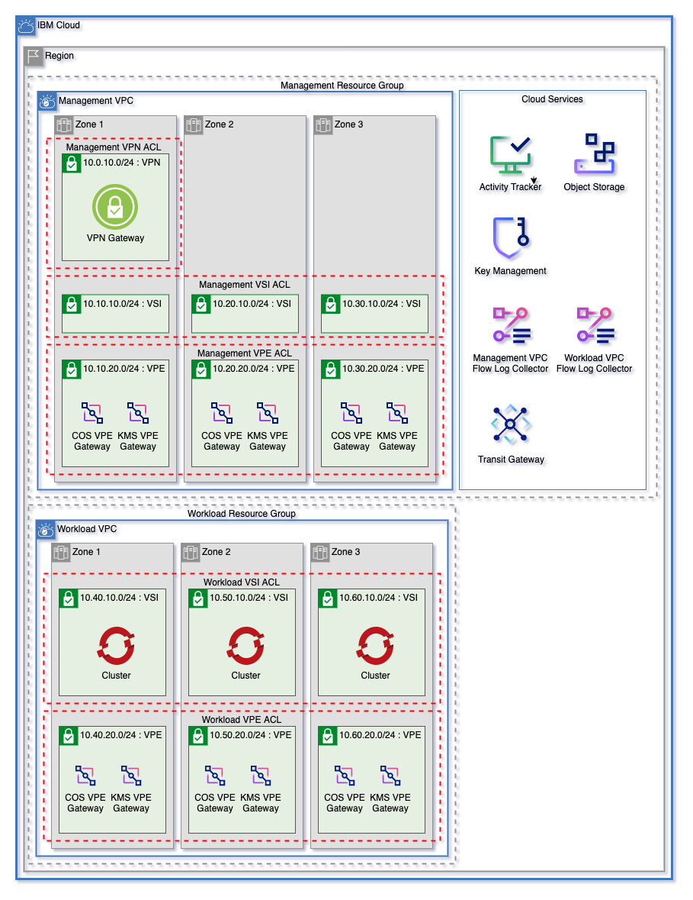

# ICSE Flexible Cluster VPC Template

Get started on IBM Cloud with a flexible landing zone for VPC Networking, Clusters, and Cloud Services with minimal inputs. Easily grow from 1 to 3 zones and manage multiple worker pools.

 1 Zone   | 3 Zones
----------|------
 | 

---

## Table of Contents

1. [Flexible VPC Network](#flexible-vpc-network)
    - [VPC Network Variables](#vpc-network-variables)
    - [Easily Expand Your Network](#easily-expand-your-architecturefrom-one-to-three-zones)
2. [Cloud Services](#cloud-services)
    - [Cloud Service Variables](#cloud-service-variables)
3. [VPC Clusters](#vpc-clusters)
    - [VPC Cluster Variables](#vpc-cluster-variables)
    - [Cluster Encryption Key](#cluster-encryption-key)
4. [Cluster Worker Pools](#cluster-worker-pools)
    - [Quick Start Worker Pools](#quick-start-worker-pools)
    - [Detailed Worker Pools](#detailed-worker-pools)
5. [Template Variables](#template-variables)
6. [Template Outputs](#template-outputs)

---

## Flexible VPC Network

This template uses the [ICSE Flexible VPC Network Template](https://github.com/Cloud-Schematics/easy-flexible-vpc-network) as a base to to create VPC Networking infrastucture. Read the full documentation [here](./.docs/network.md).

VPC Components managed by this template are:
- VPCs
- Subnets
- Network Access Control Lists
- Public Gateways
- VPN Gateway
- Transit Gateways & Gateway Connections

---

### Easily expand your architecturefrom one to three zones

Dynamically increase zones by increasing the `zones` variables. Networks are configured to ensure that network addresses within this template won't overlap.

---

### VPC Network Variables

The following variables are used to configure the VPC Network:

Name                                | Type         | Description                                                                                                                                                                                                                           | Sensitive | Default
----------------------------------- | ------------ | ------------------------------------------------------------------------------------------------------------------------------------------------------------------------------------------------------------------------------------- | --------- | --------------------------
zones                               | number       | Number of zones for each VPC                                                                                                                                                                                                          |           | 3
vpc_names                           | list(string) | Names for VPCs to create. A resource group will be dynamically created for each VPC by default.                                                                                                                                       |           | ["management", "workload"]
vpc_subnet_tiers                    | list(string) | List of names for subnet tiers to add to each VPC. For each tier, a subnet will be created in each zone of each VPC. Each tier of subnet will have a unique access control list on each VPC.                                          |           | ["vsi", "vpe"]
vpc_subnet_tiers_add_public_gateway | list(string) | List of subnet tiers where a public gateway will be attached. Public gateways will be created in each VPC using these network tiers.                                                                                                  |           | ["vpn"]
vpcs_add_vpn_subnet                 | list(string) | List of VPCs to add a subnet and VPN gateway. VPCs must be defined in `var.vpc_names`. A subnet and address prefix will be added in zone 1 for the VPN Gateway.                                                                       |           | ["management"]
enable_transit_gateway              | bool         | Create transit gateway                                                                                                                                                                                                                |           | true
transit_gateway_connections         | list(string) | List of VPC names from `var.vpc_names` to connect via a single transit gateway. To not use transit gateway, provide an empty list.                                                                                                    |           | ["management", "workload"]
existing_resource_groups            | list(string) | To create only new resource groups, leave this variable as `[]`. <br><br> List of resource groups to use for infrastructire created. This value must be the same length as `vpc_names`.<br><br>Each resource group will correspond directly to the same index as `vpc_names`.<br><br>Leave indexes as empty string (`""`) to create new resource group (ex to use an existing resource group for only `workload`, set variable to `["", "<existing-rg-name>"]`)" | | []
add_cluster_rules                   | bool                                                                                                                                                                                                                                                                                                                                                                                                                                                                                                                                                                                   | Automatically add needed ACL rules to allow each network to create and manage Openshift and IKS clusters.                                                                                               |           | true
global_inbound_allow_list           | list(string)                                                                                                                                                                                                                                                                                                                                                                                                                                                                                                                                                                           | List of CIDR blocks where inbound traffic will be allowed. These allow rules will be added to each network acl.                                                                                         |           | [ "10.0.0.0/8", "161.26.0.0/16" ]
global_outbound_allow_list          | list(string)                                                                                                                                                                                                                                                                                                                                                                                                                                                                                                                                                                           | List of CIDR blocks where outbound traffic will be allowed. These allow rules will be added to each network acl.                                                                                        |           | [ "0.0.0.0/0" ]
global_inbound_deny_list            | list(string)                                                                                                                                                                                                                                                                                                                                                                                                                                                                                                                                                                           | List of CIDR blocks where inbound traffic will be denied. These deny rules will be added to each network acl. Deny rules will be added after all allow rules.                                           |           | [ "0.0.0.0/0" ]
global_outbound_deny_list           | list(string)                                                                                                                                                                                                                                                                                                                                                                                                                                                                                                                                                                           | List of CIDR blocks where outbound traffic will be denied. These deny rules will be added to each network acl. Deny rules will be added after all allow rules.                                          |           | []
apply_new_rules_before_old_rules    | bool                                                                                                                                                                                                                                                                                                                                                                                                                                                                                                                                                                                   | When set to `true`, any new rules to be applied to existing Network ACLs will be added **before** existing rules and after any detailed rules that will be added. Otherwise, rules will be added after. |           | true
deny_all_tcp_ports                  | list(number)                                                                                                                                                                                                                                                                                                                                                                                                                                                                                                                                                                           | Deny all inbound and outbound TCP traffic on each port in this list.                                                                                                                                    |           | [22, 80]
deny_all_udp_ports                  | list(number)                                                                                                                                                                                                                                                                                                                                                                                                                                                                                                                                                                           | Deny all inbound and outbound UDP traffic on each port in this list.                                                                                                                                    |           | [22, 80]
get_detailed_acl_rules_from_json    | bool                                                                                                                                                                                                                                                                                                                                                                                                                                                                                                                                                                                                                    | Decode local file `acl-rules.json` for the automated creation of Network ACL rules. If this is set to `false`, detailed_acl_rules will be used instead.                                                 |           | false
detailed_acl_rules                  | See [variables.tf](./variables.tf#L222) for full details | OPTIONAL - List describing network ACLs and rules to add.                                                                                                                                               |           | []


---

## Cloud Services

Cloud services are also managed using the ICSE Flexible VPC Network Template as a framework. Find the full documentation on the cloud service [here](./.docs/services.md).

Cloud Services that can be created by this template:

- Key Protect
- Encryption Keys (either in Key Protect or HyperProtect Crypto Services)
- Activity Tracker
- Cloud Object Storage & Object Storage Buckets
- Secrets Manager
- Virtual Private Endpoints for VPC
- Flow Log Collectors for VPC

---

### Cloud Service Variables

The following variables are used to create cloud services:

Name                                     | Type         | Description                                                                                                   | Sensitive | Default
---------------------------------------- | ------------ | ------------------------------------------------------------------------------------------------------------- | --------- | -------------------------------
existing_hs_crypto_name                  | string       | OPTIONAL - Get data for an existing HPCS instance. If you want a KMS instance to be created, leave as `null`. |           | null
existing_hs_crypto_resource_group        | string       | OPTIONAL - Resource group name for an existing HPCS instance. Use only with `existing_hs_crypto_name`.        |           | null
enable_atracker                          | bool         | Enable activity tracker for this pattern.                                                                     |           | true
add_atracker_route                       | bool         | Add a route to the Atracker instance.                                                                         |           | false
cos_use_random_suffix                    | bool         | Add a randomize suffix to the end of each Object Storage resource created in this module.                     |           | true
create_secrets_manager                   | bool         | Create a Secrets Manager service instance.                                                                    |           | false
enable_virtual_private_endpoints         | bool         | Enable virtual private endpoints.                                                                             |           | true
vpe_services                             | list(string) | List of VPE Services to use to create endpoint gateways.                                                      |           | ["cloud-object-storage", "kms"]
vpcs_create_endpoint_gateway_on_vpe_tier | list(string) | Create a Virtual Private Endpoint for supported services on each `vpe` tier of VPC names in this list.        |           | ["management", "workload"]

---

## VPC Clusters

This template allows users to create clusters on any number of subnet tiers in any number of VPCs. The number of zones can also be scaled dynamically. Users can choose to use either Red Hat OpenShift Clusters or IBM Cloud Kubernetes Service clusters. Clusters are created using the [ICSE VPC Cluster Module](https://github.com/Cloud-Schematics/icse-cluster-module).


OpenShift Clusters require at least 2 workers across any number of zones to be provisioned. Template will fail on plan if too few workers are provided.

---

### VPC Cluster Variables

Name                            | Type         | Description                                                                                                                                                                                                                                                                                                                                                                                                                                                                         | Sensitive | Default
------------------------------- | ------------ | ----------------------------------------------------------------------------------------------------------------------------------------------------------------------------------------------------------------------------------------------------------------------------------------------------------------------------------------------------------------------------------------------------------------------------------------------------------------------------------- | --------- | ------------
cluster_type                    | string       | Cluster type. Can be `iks` or `openshift`.                                                                                                                                                                                                                                                                                                                                                                                                                                          |           | openshift
cluster_vpcs                    | list(string) | List of VPCs where clusters will be deployed.                                                                                                                                                                                                                                                                                                                                                                                                                                       |           | ["workload"]
cluster_subnet_tier             | list(string) | List of subnet tiers where clusters will be provisioned. Clusters will be provisioned on this tier in each vpc listed in `cluster_vpcs` variable.                                                                                                                                                                                                                                                                                                                                   |           | ["vsi"]
cluster_zones                   | number       | Number of zones to provision clusters for each VPC. At least one zone is required. Can be 1, 2, or 3 zones.                                                                                                                                                                                                                                                                                                                                                                         |           | 3
kube_version                    | string       | Kubernetes version to use for cluster. To get available versions, use the IBM Cloud CLI command `ibmcloud ks versions`. To use the default version, leave as default. Updates to the default versions may force this to change.                                                                                                                                                                                                                                                     |           | default
flavor                          | string       | Machine type for cluster. Use the IBM Cloud CLI command `ibmcloud ks flavors` to find valid machine types                                                                                                                                                                                                                                                                                                                                                                           |           | bx2.16x64
workers_per_zone                | number       | Number of workers in each zone of the cluster. OpenShift requires at least 2 workers.                                                                                                                                                                                                                                                                                                                                                                                               |           | 2
wait_till                       | string       | To avoid long wait times when you run your Terraform code, you can specify the stage when you want Terraform to mark the cluster resource creation as completed. Depending on what stage you choose, the cluster creation might not be fully completed and continues to run in the background. However, your Terraform code can continue to run without waiting for the cluster to be fully created. Supported args are `MasterNodeReady`, `OneWorkerNodeReady`, and `IngressReady` |           | IngressReady
update_all_workers              | bool         | Update all workers to new kube version                                                                                                                                                                                                                                                                                                                                                                                                                                              |           | false
disable_public_service_endpoint | bool         | Disable the public service endpoint on the cluster.                                                                                                                                                                                                                                                                                                                                                                                                                                 |           | false
entitlement                     | string       | If you do not have an entitlement, leave as null. Entitlement reduces additional OCP Licence cost in OpenShift clusters. Use Cloud Pak with OCP Licence entitlement to create the OpenShift cluster. Note It is set only when the first time creation of the cluster, further modifications are not impacted Set this argument to cloud_pak only if you use the cluster with a Cloud Pak that has an OpenShift entitlement.                                                         |           | null

---

### Cluster Encryption Key

By default, the cluster creates a [Key Management Key](./clusters.tf#L61) in the Key Management service managed by this module to encrypt storage.

---

## Cluster Worker Pools

Cluster worker pools can be created and managed using this template. Worker pools can either be provisioned in each cluster, or managed at a detailed level. This template uses the [ICSE Cluster Worker Pool Module](github.com/Cloud-Schematics/icse-vpc-cluster-worker-pool-module) for worker pool creation.

To ensure that worker pools can be encrypted with an encryption key, a [service authorization](./cluster_worker_pools.tf#L6) is created to allow cluster permissions to read from the Key Management source.

---

### Quick Start Worker Pools

To add a worker pool with the same configuration as the cluster it's being attached to, add the worker pool name to the [worker_pool_names variable](./variables.tf#L439).

---

### Detailed Worker Pools

Detailed worker pools can be configured either using HCL or JSON. To use JSON configuration set [use_worker_pool_json variable](./variables.tf#L450) to `true`.

---

#### Detailed Worker Pools Using HCL

Detailed worker pools can be configured using the [detailed_worker_pools variable](./variables.tf#L456).

```terraform
variable "detailed_worker_pools" {
  description = "OPTIONAL - Detailed worker pool configruation. Conflicts with `use_worker_pool_json`."
  type = list(
    object({
      pool_name   = string # Prefix will be prepended onto the pool name
      cluster_vpc = string # name of the vpc where the cluster is provisioned. used to reference cluster dynamically 
      # the folowing will default to the cluster values if not otherwise provided
      resource_group_id = optional(string)
      flavor            = optional(string)
      workers_per_zone  = optional(number)
      encryption_key_id = optional(string)
      kms_instance_guid = optional(string)
    })
  )
  ...
}
```

---

#### Detailed Worker Pools Using JSON

Worker pools can also be defined using the HCL schema by adding them into [template-worker-pools.json](./template-worker-pools.json).

---

## Template Variables

Name                                     | Type                                                                                                                                                                                                                                                                                                                                                                                                                                                                                                                                                                                                                    | Description                                                                                                                                                                                                                                                                                                                                                                                                                                                                         | Sensitive | Default
---------------------------------------- | ----------------------------------------------------------------------------------------------------------------------------------------------------------------------------------------------------------------------------------------------------------------------------------------------------------------------------------------------------------------------------------------------------------------------------------------------------------------------------------------------------------------------------------------------------------------------------------------------------------------------- | ----------------------------------------------------------------------------------------------------------------------------------------------------------------------------------------------------------------------------------------------------------------------------------------------------------------------------------------------------------------------------------------------------------------------------------------------------------------------------------- | --------- | ---------------------------------
ibmcloud_api_key                         | string                                                                                                                                                                                                                                                                                                                                                                                                                                                                                                                                                                                                                  | The IBM Cloud platform API key needed to deploy IAM enabled resources.                                                                                                                                                                                                                                                                                                                                                                                                              | true      | 
region                                   | string                                                                                                                                                                                                                                                                                                                                                                                                                                                                                                                                                                                                                  | The region to which to deploy the VPC                                                                                                                                                                                                                                                                                                                                                                                                                                               |           | 
prefix                                   | string                                                                                                                                                                                                                                                                                                                                                                                                                                                                                                                                                                                                                  | The prefix that you would like to prepend to your resources                                                                                                                                                                                                                                                                                                                                                                                                                         |           | 
tags                                     | list(string)                                                                                                                                                                                                                                                                                                                                                                                                                                                                                                                                                                                                            | List of Tags for the resource created                                                                                                                                                                                                                                                                                                                                                                                                                                               |           | null
zones                                    | number                                                                                                                                                                                                                                                                                                                                                                                                                                                                                                                                                                                                                  | Number of zones for each VPC                                                                                                                                                                                                                                                                                                                                                                                                                                                        |           | 3
vpc_names                                | list(string)                                                                                                                                                                                                                                                                                                                                                                                                                                                                                                                                                                                                            | Names for VPCs to create. A resource group will be dynamically created for each VPC by default.                                                                                                                                                                                                                                                                                                                                                                                     |           | ["management", "workload"]
existing_resource_groups                 | list(string)                                                 | "List of resource groups to use for infrastructire created. This value must be the same length as `vpc_names`. Each resource group will correspond directly to the same index as `vpc_names`. To create new resource groups, leave this variable as `[]`. Leave indexes as empty string to create new resource group.   |           | []
vpc_subnet_tiers                         | list(string)                                                                                                                                                                                                                                                                                                                                                                                                                                                                                                                                                                                                            | List of names for subnet tiers to add to each VPC. For each tier, a subnet will be created in each zone of each VPC. Each tier of subnet will have a unique access control list on each VPC.                                                                                                                                                                                                                                                                                        |           | ["vsi", "vpe"]
vpc_subnet_tiers_add_public_gateway      | list(string)                                                                                                                                                                                                                                                                                                                                                                                                                                                                                                                                                                                                            | List of subnet tiers where a public gateway will be attached. Public gateways will be created in each VPC using these network tiers.                                                                                                                                                                                                                                                                                                                                                |           | ["vpn"]
vpcs_add_vpn_subnet                      | list(string)                                                                                                                                                                                                                                                                                                                                                                                                                                                                                                                                                                                                            | List of VPCs to add a subnet and VPN gateway. VPCs must be defined in `var.vpc_names`. A subnet and address prefix will be added in zone 1 for the VPN Gateway.                                                                                                                                                                                                                                                                                                                     |           | ["management"]
enable_transit_gateway                   | bool                                                                                                                                                                                                                                                                                                                                                                                                                                                                                                                                                                                                                    | Create transit gateway                                                                                                                                                                                                                                                                                                                                                                                                                                                              |           | true
transit_gateway_connections              | list(string)                                                                                                                                                                                                                                                                                                                                                                                                                                                                                                                                                                                                            | List of VPC names from `var.vpc_names` to connect via a single transit gateway. To not use transit gateway, provide an empty list.                                                                                                                                                                                                                                                                                                                                                  |           | ["management", "workload"]
add_cluster_rules                        | bool                                                                                                                                                                                                                                                                                                                                                                                                                                                                                                                                                                                                                    | Automatically add needed ACL rules to allow each network to create and manage Openshift and IKS clusters.                                                                                                                                                                                                                                                                                                                                                                           |           | true
global_inbound_allow_list                | list(string)                                                                                                                                                                                                                                                                                                                                                                                                                                                                                                                                                                                                            | List of CIDR blocks where inbound traffic will be allowed. These allow rules will be added to each network acl.                                                                                                                                                                                                                                                                                                                                                                     |           | [ "10.0.0.0/8", "161.26.0.0/16" ]
global_outbound_allow_list               | list(string)                                                                                                                                                                                                                                                                                                                                                                                                                                                                                                                                                                                                            | List of CIDR blocks where outbound traffic will be allowed. These allow rules will be added to each network acl.                                                                                                                                                                                                                                                                                                                                                                    |           | [ "0.0.0.0/0" ]
global_inbound_deny_list                 | list(string)                                                                                                                                                                                                                                                                                                                                                                                                                                                                                                                                                                                                            | List of CIDR blocks where inbound traffic will be denied. These deny rules will be added to each network acl. Deny rules will be added after all allow rules.                                                                                                                                                                                                                                                                                                                       |           | [ "0.0.0.0/0" ]
global_outbound_deny_list                | list(string)                                                                                                                                                                                                                                                                                                                                                                                                                                                                                                                                                                                                            | List of CIDR blocks where outbound traffic will be denied. These deny rules will be added to each network acl. Deny rules will be added after all allow rules.                                                                                                                                                                                                                                                                                                                      |           | []
apply_new_rules_before_old_rules         | bool                                                                                                                                                                                                                                                                                                                                                                                                                                                                                                                                                                                                                    | When set to `true`, any new rules to be applied to existing Network ACLs will be added **before** existing rules and after any detailed rules that will be added. Otherwise, rules will be added after.                                                                                                                                                                                                                                                                             |           | true
deny_all_tcp_ports                       | list(number)                                                                                                                                                                                                                                                                                                                                                                                                                                                                                                                                                                                                            | Deny all inbound and outbound TCP traffic on each port in this list.                                                                                                                                                                                                                                                                                                                                                                                                                |           | [22, 80]
deny_all_udp_ports                       | list(number)                                                                                                                                                                                                                                                                                                                                                                                                                                                                                                                                                                                                            | Deny all inbound and outbound UDP traffic on each port in this list.                                                                                                                                                                                                                                                                                                                                                                                                                |           | [22, 80]
get_detailed_acl_rules_from_json         | bool                                                                                                                                                                                                                                                                                                                                                                                                                                                                                                                                                                                                                    | Decode local file `acl-rules.json` for the automated creation of Network ACL rules. If this is set to `false`, detailed_acl_rules will be used instead.                                                                                                                                                                                                                                                                                                                             |           | false
detailed_acl_rules                       | list( object({ acl_shortname = string rules = list( object({ shortname = string action = string direction = string add_first = optional(bool) destination = optional(string) source = optional(string) tcp = optional( object({ port_max = optional(number) port_min = optional(number) source_port_max = optional(number) source_port_min = optional(number) }) ) udp = optional( object({ port_max = optional(number) port_min = optional(number) source_port_max = optional(number) source_port_min = optional(number) }) ) icmp = optional( object({ type = optional(number) code = optional(number) }) ) }) ) }) ) | OPTIONAL - List describing network ACLs and rules to add.                                                                                                                                                                                                                                                                                                                                                                                                                           |           | []
existing_hs_crypto_name                  | string                                                                                                                                                                                                                                                                                                                                                                                                                                                                                                                                                                                                                  | OPTIONAL - Get data for an existing HPCS instance. If you want a KMS instance to be created, leave as `null`.                                                                                                                                                                                                                                                                                                                                                                       |           | null
existing_hs_crypto_resource_group        | string                                                                                                                                                                                                                                                                                                                                                                                                                                                                                                                                                                                                                  | OPTIONAL - Resource group name for an existing HPCS instance. Use only with `existing_hs_crypto_name`.                                                                                                                                                                                                                                                                                                                                                                              |           | null
enable_atracker                          | bool                                                                                                                                                                                                                                                                                                                                                                                                                                                                                                                                                                                                                    | Enable activity tracker for this pattern.                                                                                                                                                                                                                                                                                                                                                                                                                                           |           | true
add_atracker_route                       | bool                                                                                                                                                                                                                                                                                                                                                                                                                                                                                                                                                                                                                    | Add a route to the Atracker instance.                                                                                                                                                                                                                                                                                                                                                                                                                                               |           | false
cos_use_random_suffix                    | bool                                                                                                                                                                                                                                                                                                                                                                                                                                                                                                                                                                                                                    | Add a randomize suffix to the end of each Object Storage resource created in this module.                                                                                                                                                                                                                                                                                                                                                                                           |           | true
create_secrets_manager                   | bool                                                                                                                                                                                                                                                                                                                                                                                                                                                                                                                                                                                                                    | Create a Secrets Manager service instance.                                                                                                                                                                                                                                                                                                                                                                                                                                          |           | false
enable_virtual_private_endpoints         | bool                                                                                                                                                                                                                                                                                                                                                                                                                                                                                                                                                                                                                    | Enable virtual private endpoints.                                                                                                                                                                                                                                                                                                                                                                                                                                                   |           | true
vpe_services                             | list(string)                                                                                                                                                                                                                                                                                                                                                                                                                                                                                                                                                                                                            | List of VPE Services to use to create endpoint gateways.                                                                                                                                                                                                                                                                                                                                                                                                                            |           | ["cloud-object-storage", "kms"]
vpcs_create_endpoint_gateway_on_vpe_tier | list(string)                                                                                                                                                                                                                                                                                                                                                                                                                                                                                                                                                                                                            | Create a Virtual Private Endpoint for supported services on each `vpe` tier of VPC names in this list.                                                                                                                                                                                                                                                                                                                                                                              |           | ["management", "workload"]
cluster_type                             | string                                                                                                                                                                                                                                                                                                                                                                                                                                                                                                                                                                                                                  | Cluster type. Can be `iks` or `openshift`.                                                                                                                                                                                                                                                                                                                                                                                                                                          |           | openshift
cluster_vpcs                             | list(string)                                                                                                                                                                                                                                                                                                                                                                                                                                                                                                                                                                                                            | List of VPCs where clusters will be deployed.                                                                                                                                                                                                                                                                                                                                                                                                                                       |           | ["workload"]
cluster_subnet_tier                      | list(string)                                                                                                                                                                                                                                                                                                                                                                                                                                                                                                                                                                                                            | List of subnet tiers where clusters will be provisioned.                                                                                                                                                                                                                                                                                                                                                                                                                            |           | ["vsi"]
cluster_zones                            | number                                                                                                                                                                                                                                                                                                                                                                                                                                                                                                                                                                                                                  | Number of zones to provision clusters for each VPC. At least one zone is required. Can be 1, 2, or 3 zones.                                                                                                                                                                                                                                                                                                                                                                         |           | 3
kube_version                             | string                                                                                                                                                                                                                                                                                                                                                                                                                                                                                                                                                                                                                  | Kubernetes version to use for cluster. To get available versions, use the IBM Cloud CLI command `ibmcloud ks versions`. To use the default version, leave as default. Updates to the default versions may force this to change.                                                                                                                                                                                                                                                     |           | default
flavor                                   | string                                                                                                                                                                                                                                                                                                                                                                                                                                                                                                                                                                                                                  | Machine type for cluster. Use the IBM Cloud CLI command `ibmcloud ks flavors` to find valid machine types                                                                                                                                                                                                                                                                                                                                                                           |           | bx2.16x64
workers_per_zone                         | number                                                                                                                                                                                                                                                                                                                                                                                                                                                                                                                                                                                                                  | Number of workers in each zone of the cluster. OpenShift requires at least 2 workers.                                                                                                                                                                                                                                                                                                                                                                                               |           | 2
wait_till                                | string                                                                                                                                                                                                                                                                                                                                                                                                                                                                                                                                                                                                                  | To avoid long wait times when you run your Terraform code, you can specify the stage when you want Terraform to mark the cluster resource creation as completed. Depending on what stage you choose, the cluster creation might not be fully completed and continues to run in the background. However, your Terraform code can continue to run without waiting for the cluster to be fully created. Supported args are `MasterNodeReady`, `OneWorkerNodeReady`, and `IngressReady` |           | IngressReady
update_all_workers                       | bool                                                                                                                                                                                                                                                                                                                                                                                                                                                                                                                                                                                                                    | Update all workers to new kube version                                                                                                                                                                                                                                                                                                                                                                                                                                              |           | false
disable_public_service_endpoint          | bool                                                                                                                                                                                                                                                                                                                                                                                                                                                                                                                                                                                                                    | Disable the public service endpoint on the cluster.                                                                                                                                                                                                                                                                                                                                                                                                                                 |           | false
entitlement                              | string                                                                                                                                                                                                                                                                                                                                                                                                                                                                                                                                                                                                                  | If you do not have an entitlement, leave as null. Entitlement reduces additional OCP Licence cost in OpenShift clusters. Use Cloud Pak with OCP Licence entitlement to create the OpenShift cluster. Note It is set only when the first time creation of the cluster, further modifications are not impacted Set this argument to cloud_pak only if you use the cluster with a Cloud Pak that has an OpenShift entitlement.                                                         |           | null
worker_pool_names                        | list(string)                                                                                                                                                                                                                                                                                                                                                                                                                                                                                                                                                                                                            | Names of worker pools to add to the cluster. Worker pools added this way will be provisioned in the same zones, flavor, and entitlement as the parent cluster.                                                                                                                                                                                                                                                                                                                      |           | []
use_worker_pool_json                     | bool                                                                                                                                                                                                                                                                                                                                                                                                                                                                                                                                                                                                                    | Use detailed JSON information for the creation of worker pools from JSON. Conflicts with `detailed_worker_pools`.                                                                                                                                                                                                                                                                                                                                                                   |           | false
detailed_worker_pools                    | list( object({ pool_name = string cluster_vpc = string resource_group_id = optional(string) flavor = optional(string) workers_per_zone = optional(number) encryption_key_id = optional(string) kms_instance_guid = optional(string) }) )                                                                                                                                                                                                                                                                                                                                                                                | OPTIONAL - Detailed worker pool configruation. Conflicts with `use_worker_pool_json`.                                                                                                                                                                                                                                                                                                                                                                                               |           | []

---

## Template Outputs

Name                 | Description
-------------------- | ----------------------------------------------------------------------------------------------------------
vpc_networks         | VPC network information
vpc_flow_logs_data   | Information for Connecting VPC to flow logs using ICSE Flow Logs Module
vpc_network_acls     | List of network ACLs
key_management_name  | Name of key management service
key_management_crn   | CRN for KMS instance
key_management_guid  | GUID for KMS instance
key_rings            | Key rings created by module
keys                 | List of names and ids for keys created.
cos_instances        | List of COS resource instances with shortname, name, id, and crn.
cos_buckets          | List of COS bucket instances with shortname, instance_shortname, name, id, crn, and instance id.
secrets_manager_name | Name of secrets manager instance
secrets_manager_id   | id of secrets manager instance
secrets_manager_guid | guid of secrets manager instance
cluster_list         | ID, name, crn, ingress hostname, private service endpoint url, public service endpoint url of each cluster
